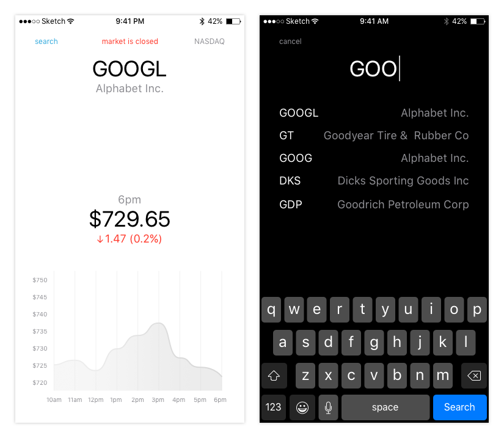
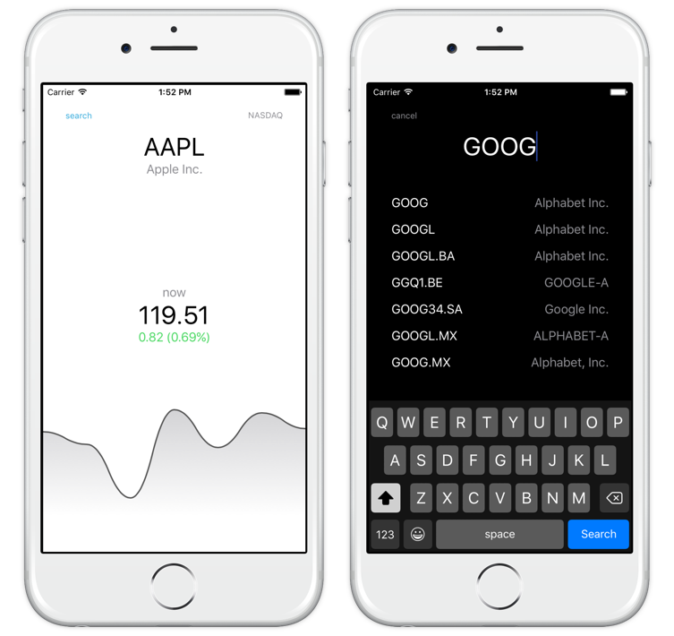
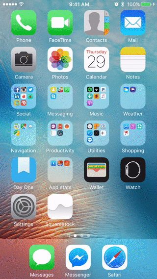

#Squarestock
A stock tracker app made for Squarespace as part of the internship interview process.

###Idea
Squarestock is a simple and clean app to keep up to date with the latest movements of any stock at any of the major exchanges. 

###Features
Given the time restrictions and my other obligations at the time, many of the features I'd like to see in this app haven't been implemented yet. As of now you can:

* Search for a stock by either ticker or company name.
* See current status of market (if its closed).
* See current (latest) value of a stock, and at what time it was trading for that.
* See daily movements of stock*. 

###Design

When designing Squarestock, simplicity was an important factor. Many of the existing stock tracker apps are overly cluttered and advanced. For most people this may be what they want, but I just want a simple overview of the daily movements of a given stock.

Because of problems relating to lack of data, I redesigned the chart a bit. This is what the app currently looks like:

###How to use
Upon opening the app for the first time, you should see information about AAPL (Apple Inc.). If you want to change what stock you're looking at, either tap the ticker (symbol) or "search"-button.

Search for either company name or ticker symbol, and select the stock you want more information about. 

To close the search menu without selecting a new stock, tap anywhere outside the tableview and textfield or "cancel" in the upper left corner.

###Architecture
I used the Apple recommended `MVC` (`Model-View-Controller`) architecture, with the addition of **managers**. A manager is responsible for querying the web services, handling the response, and creating the objects.

The app is laid out as follows:

* **Managers:**
	* `StockManager` - responsible for querying the API, generating the objects, and handling errors.
* **Views:**
	* `TickerTableViewCell` - custom `UITableViewCell` subclass for the search view controller's tableview.
	* `LineGraphView` - custom `BEMSimpleLineGraphView` subclass that implements custom drawing for a different design.
* **Models:**
	* `AppDelegate`- standard delegate for `UIApplication`.
	* `Stock` - single stock object, containing information about company, current price, open price, historic price, and computed stats about those (overall trend, percent change, etc.).
	* `Company` - single company object, containing information about ticker, company (/stock) name, and market exchange.
	* `Price` - single price object, containing information about a value (/stock price) and the date at which the value was current.
* **Controllers:**
	* `StockDetailViewController` - custom `UIViewController` subclass responsible for querying the `StockManager` and displaying the returned stock information. Also assigned as `Data Source` for `LineGraphView` and `Delegate` for `SearchViewController`. 
	* `SearchViewController` - custom `UIViewController` subclass responsible for querying the `StockManager` upon value changed in the `UITextField`, and displaying the returned information in a `UITableView`. Also assigned as `Data Source` and `Delegate` for `UITableView`.
* **XIBs**:
	* `Main` - interface builder document for the main layout of the app.
	* `LaunchScreen` - interface builder document for the launch screen of the app.

---

###Development problems:
During development I ran into a number of problems. The biggest was that there is no official single unified documented API to get information about individual stocks, or the market on which they're trading.

Google Finance API has been unavailable since 2011, Yahoo! Finance does not provide an official API, and Bloomberg charges around $799 a year. 

As a result I was forced to use old outdated unofficial undocumented APIs provided by Yahoo!.

The first API I had to use is an undocumented symbol-lookup API from Yahoo! that runs over plain HTTP. As a result I had to specify that the app allows unsecure connections, but this still causes some connection issues from time to time.

The second API I had to use is a stock data API that returns data in CSV format and seemingly without  following any standards. Dates/times are returned as strings with extra quotes around them, and in the local time zone of the stock market without specifying what time zone this is. Times are also returned in 12h format and dates as mm/dd, but this may differ depending on the current locale.

There are no APIs for getting historical hourly updated data, which is needed for the chart. Because of this (for demo purposes) I'm using the open and current price as endpoints, and generating 4 random values in between. This means the overall trend of the chart is correct, but the details are not. Because the data is not accurate, I decided to remove the labels and grid of the chart and disable user interaction (scrolling across it would update the price and time labels), in favor of simplifying the UI a bit.

There is also no API to get information about whether a specific market is open, closed, or delayed. Instead I'm using the last trade time to determine whether the market is *probably* closed (if it's older than 1h).

###Assumptions
* The data for the chart is not accurate, as I have not found an API that returns live hourly data for a given stock. Instead I'm using the open/ current price as endpoints and random values in between (for demonstration purposes).
* The stock status information is a guess based on the time of the latest trade. If it is more than 1h, the market is assumed to be closed. There is currently no way of telling whether the data is simply delayed. 
* Error handling is done on a must-know basis for debugging purposes. In a production app, errors need to be handled in a more user-friendly way. 

###Known Issues
* The last trade date returned from the API is given in the local timezone of the market, but the timezone is not known. Therefore the timezone is assumed to be the current time zone of the device, which means the time (and therefore also market status) is incorrect for foreign exchanges.
	* *Possible solution:* Find an API that returns/ set up a server that contains information about a specific market exchange.

###Future Features
* **3D Touch** - force touching the app icon should bring up a list over the most recently viewed stocks and their current value.
* **Notification Center** - custom widget allowing you to see the latest movements of your currently selected stock straight from the notification center.
* **Local Currency** - display the local currency for a given stock its value is given in.
* **Live Market Status** - display real-time information about a market (whether it is open, closed, or delayed). 
* **Notifications** - subscribe to major changes/ breaking news for a given stock.
* **Multiple Stocks** - swipe between recently viewed stocks on the main screen of the app. 

###3rd party libraries
I tried to refrain from using 3rd party libraries in this project. For example I used `NSURLSession` instead of the `AFNetworking` library, both to show that I can but also because `AFNetworking` provides unnecesarry overhead for a task as simple as querying an open API. 

However a part of the description of this project was to show why I love iOS Development, and one of the reasons is the number and quality of open source free 3rd party libraries offered. 

Therefore I decided to use the `BEMSimpleLineGraph` library to draw the graph. It's an amazingly simple protocol based library with vast customization options that perfectly fit the requirements for this project. Depending on those requirements, I probably normally would've made my own class. But right now the library does what I need it to, and then some. 